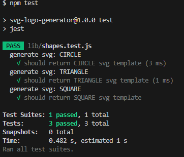

# SVG Logo Generator

## Table Of Contents
* [Description](#description)
* [Installation](#installation)
* [Usage](#usage)
* [Demo](#demo)
* [Test](#test)
* [Tools Used](#tools-used)
* [Credits](#credits)
* [Licnese](#license)

## Description
This application allows you to quickly and easily generate a high quality 300x200 pixel logo for your projects within seconds. \
Answer 4 simple questions about your design and it will be generated for you so that you don't need to hire a graphic designer!

## Installation
1. Download the code files
2. Install node.js [here](https://nodejs.org/en/)
3. Open terminal and navigate to folder containing code files
4. Run the following code to install dependancies: `npm i`

## Usage
HOW TO USE: \
**Assuming your terminal location is the same from [installation](#installation) instructions** 
1. Launch program by typing the following code: `node index.js`
2. You will be prompted a series of questions in the terminal.
3. Submit each answer by pressing 'Enter'
4. Once you are done, a prompt will appear that says `Your SVG has been generated!`
5. Navigate to the folder titled 'results'
6. Your newly generated SVG will be located within the 'results' folder and will be titled according to the text you inputed in the prompt (Ex: abc.svg)

## Demo
Click [here](https://drive.google.com/file/d/1M_ir0_WIBRlHDcQBfBI2VyEzxuy44OJ8/view?usp=sharing) for a video walkthrough.

## Test
[Jest.js](https://jestjs.io/) is included in the 'package.json' and will be installed if you have already followed the [installation](#installation) instructions. \
If you would like to run the current tests, type `npm test` into your terminal. \
 
The following is a screenshot of the current 3 tests passing:

Click [here](https://drive.google.com/file/d/18cUoSNEMzQlNt-H1d-GDOxVfjJusR0e4/view?usp=sharing) for a video of tests passing.

## Tools Used
- [Node.js](https://nodejs.org/en/)
- [Inquirer](https://www.npmjs.com/package/inquirer)
- [Jest.js](https://jestjs.io/)

## Credits 

**W3 Schools** \
[SVG Tutorial](https://www.w3schools.com/graphics/svg_intro.asp)

**Stack Overflow** \
[Creating an equilateral triangle using svg in html](https://stackoverflow.com/questions/54955165/create-a-equilateral-triangle-using-svg-in-html-with-base-and-height-100px) \
[Validating answers with inquirer](https://stackoverflow.com/questions/57321266/how-to-test-inquirer-validation)

## License

